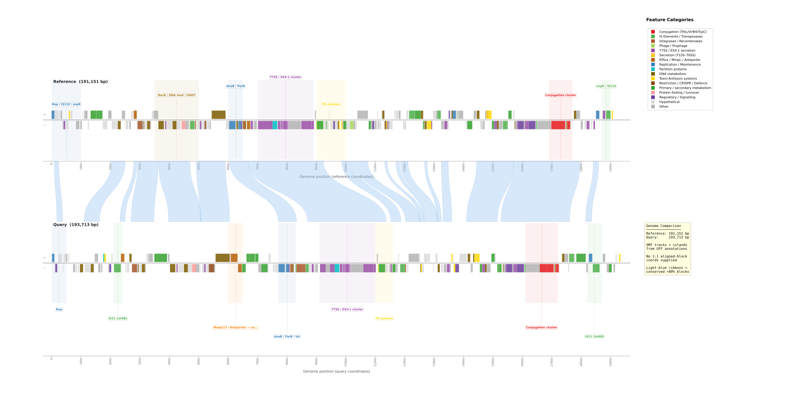
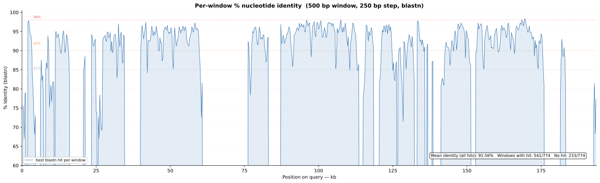

# synviz — Synteny visualization for any DNA sequences

A command-line pipeline for comparing two DNA sequences, generating:
- A **dual-axis synteny map** with ORF tracks, genomic island bands, key gene highlights, and curved light-blue ribbons connecting conserved (>90% identity) blocks
- A **standalone ribbon plot** showing syntenic connections between the two genomes
- A **per-window %identity plot** (500 bp sliding blastn windows)
- **Tabular data** with per-window blastn results and merged high-identity regions





---

## Software Requirements

| Software | Version | Purpose |
|----------|---------|---------|
| **Python** | ≥ 3.9 | Pipeline orchestration & plotting |
| **BLAST+** | ≥ 2.12 | `blastn` and `makeblastdb` for per-window identity |
| **matplotlib** | ≥ 3.5 | SVG figure generation |
| **numpy** | ≥ 1.21 | Numerical arrays |

All Python dependencies can be installed with:

```bash
pip install matplotlib numpy
```

BLAST+ must be installed separately. On macOS:

```bash
brew install blast
```

On Ubuntu/Debian:

```bash
sudo apt install ncbi-blast+
```

---

## Quick Start

```bash
# Show help (safe — no execution)
python scripts/run_synteny_pipeline.py

# Full run with all inputs
python scripts/run_synteny_pipeline.py --run \
    --ref-fasta ref.fasta --ref-gff ref.gff3 \
    --qry-fasta qry.fasta --qry-gff qry.gff3 \
    --islands-ref ref_islands.tsv --islands-qry qry_islands.tsv \
    --suffix my_comparison
```

Without `--run`, the script prints help and exits — it never runs by default.
Use '--islands-qry auto' to automatically identify common genomic islands from the annotation file

---

## Usage

### Full example (all inputs)

```bash
python scripts/run_synteny_pipeline.py --run \
    --ref-fasta path/to/reference.fasta \
    --ref-gff   path/to/reference.gff3 \
    --qry-fasta path/to/query.fasta \
    --qry-gff   path/to/query.gff3 \
    --islands-ref path/to/ref_islands.tsv \
    --islands-qry path/to/qry_islands.tsv \
    --suffix    my_comparison
```

This generates:

```
blastn_identity_windows_my_comparison.tsv
identity_plot_my_comparison.svg
high_identity_regions_my_comparison.tsv
comparison_map_my_comparison.svg
ribbon_synteny_my_comparison.svg
```

### FASTA-only (no annotations)

**GFF files are optional.** If omitted, the comparison map draws genome bars and ribbons only (no ORF tracks, no island bands).

```bash
python scripts/run_synteny_pipeline.py --run \
    --ref-fasta ref.fasta \
    --qry-fasta qry.fasta \
    --suffix fasta_only
```

### Tagged outputs (preserve previous plots)

```bash
python scripts/run_synteny_pipeline.py --run \
    --ref-fasta ref.fasta --qry-fasta qry.fasta \
    --suffix comparison_A
```

All output files are tagged with `_comparison_A`:

```
blastn_identity_windows_comparison_A.tsv
identity_plot_comparison_A.svg
high_identity_regions_comparison_A.tsv
comparison_map_comparison_A.svg
ribbon_synteny_comparison_A.svg
```

### Genomic island bands

Control the coloured annotation bands drawn behind each ORF track. The
reference and query tracks are configured **independently** so you can, for
example, supply curated island definitions for the reference while letting
the query auto-generate its bands from GFF.

```bash
# Auto-generate from GFF annotations (default when GFF is present)
python scripts/run_synteny_pipeline.py --run \
    --ref-fasta ref.fasta --ref-gff ref.gff3 \
    --qry-fasta qry.fasta --qry-gff qry.gff3 \
    --islands-ref auto --islands-qry auto --suffix auto_islands

# No island bands on either track
python scripts/run_synteny_pipeline.py --run \
    --ref-fasta ref.fasta --qry-fasta qry.fasta \
    --islands-ref none --islands-qry none --suffix plain

# Curated islands for the reference; query uses auto-generated bands
python scripts/run_synteny_pipeline.py --run \
    --ref-fasta ref.fasta --ref-gff ref.gff3 \
    --qry-fasta qry.fasta --qry-gff qry.gff3 \
    --islands-ref ref_islands.tsv --islands-qry auto --suffix curated_ref

# Read island definitions from TSV files for both genomes
# (in-plot text labels are drawn on the corresponding track only when a
#  TSV file is supplied — 'auto' / 'none' modes keep the bands unlabelled)
python scripts/run_synteny_pipeline.py --run \
    --ref-fasta ref.fasta --ref-gff ref.gff3 \
    --qry-fasta qry.fasta --qry-gff qry.gff3 \
    --islands-ref ref_islands.tsv --islands-qry qry_islands.tsv \
    --suffix with_islands
```

> When islands come from a TSV file, each band is annotated in-plot with its
> text label (staggered onto multiple tiers below the track to avoid overlap).
> In `auto` / `none` modes the bands stay unlabelled — the legend on the right
> of the figure identifies the colours.

**Island file format** (TSV):

```
# Comments start with #
# start  end     label                   color (optional)
0        10000   Rep / IS elements       #377EB8
35000    50000   DNA metabolism          #A6761D
70000    89000   T7SS / ESX-1 cluster    #984EA3
169000   177000  Conjugation cluster     #E41A1C
```

If the colour column is omitted, it is auto-assigned from the label text.

### Step control

| Flag | Effect |
|------|--------|
| `--skip blastn` | Re-use existing blastn data (saves ~1–2 min) |
| `--only map` | Regenerate only the comparison map (auto-resolves dependencies) |
| `--force` | Re-run steps even if outputs already exist |
| `--dry-run` | Preview what would run without executing |

---

## Pipeline Steps

The pipeline runs four steps in dependency order:

| Step | Script | Input | Output |
|------|--------|-------|--------|
| **1. blastn windows** | `blastn_identity_windows.py` | Ref + query FASTA | `blastn_identity_windows.tsv`, `identity_plot.svg` |
| **2. high-identity regions** | `high_identity_regions.py` | blastn TSV | `high_identity_regions.tsv` |
| **3. comparison map** | `comparison_map.py` | GFFs + regions TSV | `comparison_map.svg` |
| **4. standalone ribbon** | `ribbon_synteny_plot.py` | regions TSV | `ribbon_synteny.svg` |

### Step 1 — blastn identity windows

- Slides a 500 bp window across the query genome (250 bp step)
- Each window is blasted against the reference
- The best HSP (by bitscore) is recorded per window
- Output: TSV with query position, ref position, %identity, strand, bitscore
- Also generates a continuous %identity line plot (y-axis 60–100%)

### Step 2 — high-identity regions

- Reads the per-window TSV
- Merges consecutive windows with >90% identity into contiguous blocks
- Reports each block's coordinates in both genomes
- Output: TSV of conserved blocks (number and total span depend on the inputs)

### Step 3 — comparison map (dual-axis synteny)

- Two horizontal tracks: reference (top) and query (bottom), each with independent x-axes
- ORF boxes coloured by functional category (conjugation, T7SS, IS elements, metabolism, regulation, etc.)
- Genomic island bands (auto-generated or from file)
- Key gene labels with arrows
- Light-blue curved cubic-Bezier ribbons connecting conserved blocks
- Semi-transparent blue connector for the 1:1 aligned region
- Legend and summary box on the right. Only categories present in the data are shown.

### Step 4 — standalone ribbon plot

- Clean two-genome diagram with only the curved light-blue ribbons
- No ORF tracks — focused on synteny structure

---

## Output Files

| File | Format | Description |
|------|--------|-------------|
| `blastn_identity_windows*.tsv` | TSV | Per-window blastn results: query pos, ref pos, %id, strand, bitscore |
| `identity_plot*.svg` | SVG | %identity vs query position (continuous line, 60–100% y-axis) |
| `high_identity_regions*.tsv` | TSV | Merged >90% conserved blocks with coordinates in both genomes |
| `comparison_map*.svg` | SVG | Dual-axis synteny map with ORFs, islands, key genes, and curved ribbons |
| `ribbon_synteny*.svg` | SVG | Standalone light-blue curved-ribbon synteny diagram |

All `*` placeholders are replaced by the `--suffix` value (if provided).

---

## Architecture

```
scripts/
├── run_synteny_pipeline.py    # Master orchestrator (CLI entry point)
├── _pipeline_paths.py         # Shared path resolution (env-var overrides)
├── blastn_identity_windows.py # Step 1: per-window blastn
├── high_identity_regions.py   # Step 2: merge conserved blocks
├── comparison_map.py          # Step 3: dual-axis synteny map + ribbons
└── ribbon_synteny_plot.py     # Step 4: standalone ribbon plot
```

Each step script can also be run independently using environment variables:

```bash
SYNTENY_REF_FASTA=ref.fasta \
SYNTENY_QRY_FASTA=qry.fasta \
SYNTENY_REF_GFF=ref.gff3 \
SYNTENY_QRY_GFF=qry.gff3 \
SYNTENY_SUFFIX=standalone \
python scripts/comparison_map.py
```

---

## Environment Variables

For advanced / scripted use, the following environment variables override defaults:

| Variable | Purpose | Default |
|----------|---------|---------|
| `SYNTENY_REF_FASTA` | Reference FASTA path | `test_files/ref.fasta` |
| `SYNTENY_REF_GFF` | Reference GFF path | `test_files/ref.gff3` |
| `SYNTENY_QRY_FASTA` | Query FASTA path | `test_files/qry.fasta` |
| `SYNTENY_QRY_GFF` | Query GFF path | `test_files/qry.gff3` |
| `SYNTENY_SUFFIX` | Output filename suffix | (none) |
<<<<<<< HEAD
| `SYNTENY_ISLANDS` | Island mode: `auto`, `none`, or file path | `auto` |
=======
| `SYNTENY_ISLANDS_REF` | Reference island bands: `auto`, `none`, or TSV path | `auto` |
| `SYNTENY_ISLANDS_QRY` | Query island bands: `auto`, `none`, or TSV path | `auto` |
| `SYNTENY_REF_ALN_START` / `SYNTENY_REF_ALN_END` | Optional 1:1 aligned-block reference coords (for the comparison-map connector) | (unset — connector skipped) |
| `SYNTENY_QRY_ALN_START` / `SYNTENY_QRY_ALN_END` | Optional 1:1 aligned-block query coords | (unset — connector skipped) |

---

## Functional categories

The `categorise()` function in `comparison_map.py` assigns each CDS a functional category based on its product description. Below are the current categories with their plot colours:

| Category | Colour | Example keywords |
|----------|--------|-----------------|
| Conjugation |  red | trbl, virb, tcp, aaa-like |
| IS elements |  green | transposase, ist, tnp |
| Integrases / Recombinases |  brown | integrase, recombinase, resolvase |
| Phage / Prophage |  orange | phage, capsid, tail fiber |
| T7SS / ESX-1 |  purple | ecc, mycp, esx, type vii |
| Secretion (T1SS–T6SS) |  dark orange | type iv/vi/v, tss, hcp, vgrg |
| Motility / Adhesion |  light green | flagell, pilin, fimbri |
| Efflux / Transport |  orange | mmpl, efflux, antiporter |
| Transport / Permeases |  pink | abc transporter, permease, mdr |
| Replication / Maintenance |  blue | rep, parb, dnab, helicase |
| Partition |  light blue | par, partition, centromere |
| DNA metabolism |  mustard | ligase, methylase, nuclease, recombinase |
| Toxin-Antitoxin |  gold | toxin, antitoxin, vapc, hipa |
| Restriction / CRISPR / Defence |  dark brown | crispr, cas, restriction, modification |
| Primary / secondary metabolism |  dark green | dehydrogenase, synthase, lyase, transferase |
| Ribosomal / Translation |  pale green | ribosomal, trna, elongation factor |
| Transcription / RNA metabolism |  lavender | rnase, sigma factor, rna polymerase |
| Protein folding / turnover |  pink | chaperone, heat shock, protease, clpp |
| Regulation / Signalling |  dark purple | regulator, two-component, histidine kinase |
| Antibiotic resistance |  bright red | beta-lactamase, drug resistance, chloramphenicol |
| Stress / DNA repair / ROS |  teal | dna repair, heat shock, sod, catalase |
| Hypothetical |  grey | hypothetical protein |
| Other |  dark grey | (catch‑all) |
>>>>>>> 802d5ba (Visual fixes applied)
